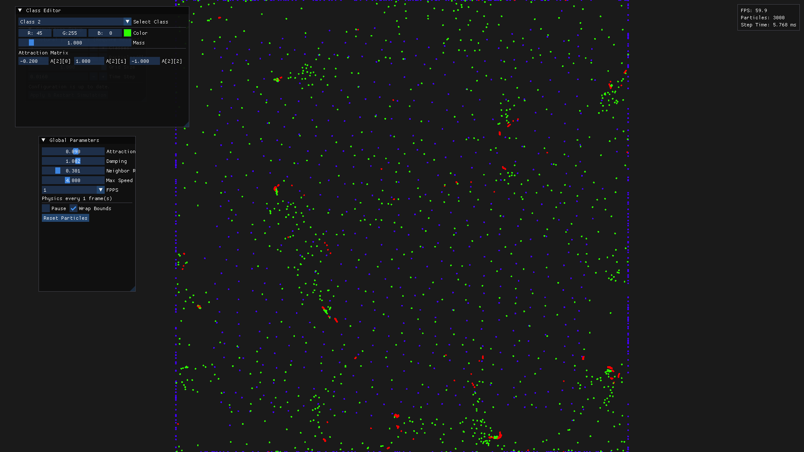

# High-Performance Particle Simulation

A real-time, high-performance particle simulation engine built with C++20, OpenGL, and OpenMP. This project simulates emergent behaviors through simple pairwise interaction rules, optimised to run as many particles as possible. 

The main limitation is the neighbor search for each particle, the current approach uses a predefined grid decomposition of the space with each cell larger in surface than the neighbor radius, which reduces per-particle query range, but is limiting the behaviors that we can model. Simulations currently run at 60FPS for an average of 1500 particle per grid cell. 

Current topics I'm currently focused on are:  
- Per-cell populations evolve: Some behaviors like an accumulation of particles in one region can neutralise the benefit of using a grid, since some particular cells may end up hosting the entire population, I am looking for ways to make the grid evolve with respect to evolution while keeping the computation overhead minimal. 
- GPU parallelization: OpenMP did a great job to make simulations faster, but I am currently working on transfering the per-particle physics computations to be done on GPU via Compute shaders.



## Features

- **Visualisation and interactiveness:** There is a simple GUI panel that allows tweaking the parameters (forces, ...) as the simulation runs live 

- **Performance:**
    - **Spatial Partitioning:** Uses a CSR-based (Compressed Sparse Row) spatial grid for $O(1)$ neighbor queries **assuming a uniform distribution of particles throughout the space**.
    - **Parallel Execution:** Physics updates are parallelized using OpenMP.

- **Optimal rendering:** As this is fully done on the GPU, the rendering overhead is quite minimized, the latency mostly comes from the CPU computation

## Getting Started

### Building tools

- **C++20 Compiler** (GCC 10+, Clang 10+, or MSVC 2019+)
- **CMake** (3.20+)
- **OpenGL 3.3+**
- **OpenMP** (optional, for multi-threaded performance)

### External dependencies
- [GLFW](https://github.com/glfw/glfw): Windowing and input.
- [Glad](https://github.com/Dav1dde/glad): OpenGL loader.
- [Dear ImGui](https://github.com/ocornut/imgui): Graphical user interface.

### Building the Project

```bash
# Clone the repository and its submodules
git clone --recursive https://github.com/yourusername/particle-sim.git
cd particle-sim

# Create build directory
mkdir build && cd build

# Configure and build (Release mode recommended for performance)
cmake -DCMAKE_BUILD_TYPE=Release ..
cmake --build .
```

### Running the Simulation

```bash
./main [options]
```

**CLI Options:**
- `--classes <N>`: Number of particle classes (default: 1)
- `--particles <N>`: Particles per class (default: 1000)
- `--radius <F>`: Interaction radius (default: 1.0)
- `--strength <F>`: Global attraction strength (default: 0.0)
- `--fpps <N>`: Frames per physics step (default: 1)
- `--grid-size <F>`: Grid cell size for spatial partitioning (default: 0.2)
- `--max-speed <F>`: Maximum particle velocity (default: 4.0)
- `--time-step <F>`: Integration time step (default: 0.016)
- `--wrap <0|1>`: Enable/disable bounds wrapping (default: 0)
- `--help`: Show all available options

## Technical Details

### Physics & Interactions

The simulation updates particle velocities based on a distance-weighted attraction matrix. For a detailed explanation of the rules, see:
- [Interaction Rule Concept](docs/interaction-rule.md)
- [Velocity Update Rules](docs/velocity-update-rule.md)

### Optimization Roadmap
